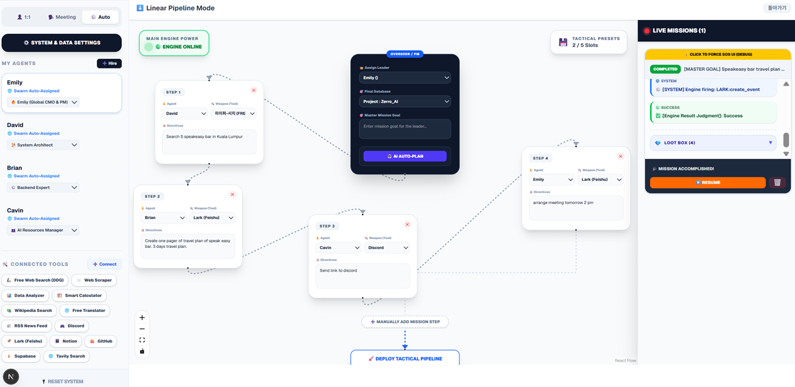
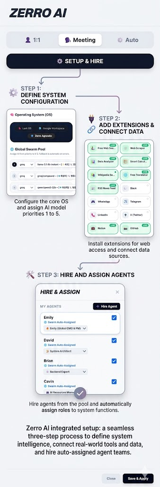

# Zerro AI Landing

Zerro AI Landing is the public landing page repository for **Zerro AI OS**, a next-gen multi-agent automation studio positioned as a Workspace OS for technical teams. The page introduces the product vision, shows the Linear Pipeline command center, explains the one-shot setup flow, and links users to the live workspace at [zerroai.space](https://zerroai.space).

> Beyond chatbots. Workspace OS.

## Table of Contents

- [Overview](#overview)
- [Live Links](#live-links)
- [Product Message](#product-message)
- [Key Capabilities Highlighted on the Landing Page](#key-capabilities-highlighted-on-the-landing-page)
- [User Journey](#user-journey)
- [Visual Assets](#visual-assets)
- [Technology Stack](#technology-stack)
- [Repository Structure](#repository-structure)
- [Local Development](#local-development)
- [API Key Setup Flow](#api-key-setup-flow)
- [Automated Project Card Updates](#automated-project-card-updates)
- [Deployment Notes](#deployment-notes)
- [Security Notes](#security-notes)
- [Maintenance Checklist](#maintenance-checklist)

## Overview

This repository contains a static landing page for Zerro AI. It is built as a single `index.html` file using Tailwind CSS from the CDN, local image assets, and a small amount of inline JavaScript for the setup-guide modal.

The landing page presents Zerro AI as a workspace-level AI command center with:

- Parallel AI-agent orchestration (Swarm Engine)
- **Zerro Dev Studio** — web + Windows desktop (agent-first pastel-mint UI, EN/KO)
- Long-term vector memory
- Hyper-search across external information sources
- Native JSON function calling
- ReAct-style agent recovery loops
- Workspace-aware output routing for Lark, Google Workspace, Slack, Notion, Supabase, GitHub, and related tools
- Public install page with **EN / 한국어** toggle for Desktop Setup + CLI

## Live Links

| Resource | URL |
| --- | --- |
| Live command center | <https://zerroai.space> |
| Landing site | <https://benjamin5607.github.io/zerro_ai_landing/> |
| **Dev Studio install (Desktop + CLI)** | <https://benjamin5607.github.io/zerro_ai_landing/dev-studio.html> |
| Windows Desktop Setup (v0.2.8) | <https://github.com/Benjamin5607/zerro_ai_landing/releases/tag/desktop-v0.2.8> |
| Landing repository | <https://github.com/Benjamin5607/zerro_ai_landing> |

## Zerro Dev Studio

**Desktop App (recommended)** — windowed local IDE with Ollama one-click, native folders, Shell tab, agent-first pastel-mint UI (shared with web), and **EN / 한국어** on the install page + in-app.

```text
Download Setup.zip → extract → double-click Install.cmd
https://github.com/Benjamin5607/zerro_ai_landing/releases/download/desktop-v0.2.8/Zerro-Dev-Studio-0.2.8-Setup.zip
```

```powershell
irm https://raw.githubusercontent.com/Benjamin5607/zerro_ai_landing/main/zerro-dev-studio/install-desktop.ps1 | iex
```

**CLI (advanced / CI)** — installable agent with real bash, git, and filesystem. Package: [`zerro-dev-studio/`](./zerro-dev-studio).

```bash
curl -fsSL https://raw.githubusercontent.com/Benjamin5607/zerro_ai_landing/main/zerro-dev-studio/install.sh | bash
```

```bash
export GROQ_API_KEY=…
cd your-project && zerro-dev
```

Install page (EN default + KO toggle): [dev-studio.html](https://benjamin5607.github.io/zerro_ai_landing/dev-studio.html)

Core app source lives in the private `zero_ai` repo (Next.js + Electron). This landing repo hosts public install pages, the CLI package, and Windows Setup releases.
## Product Message

Zerro AI is described as a **Next-Gen AI Orchestration Layer** designed to coordinate multiple specialized agents in parallel. The landing page emphasizes a shift away from single-threaded chatbot workflows toward an operating-system style interface where an "Overseer" can analyze objectives, route work to specialized agents, and return structured outputs to the user's active workspace.

Core positioning:

- **Command multiple AI agents in parallel** instead of relying on one linear assistant.
- **Route tasks by dependency and specialization** so independent work can execute simultaneously.
- **Use long-term memory** through Supabase vector storage and Gemini embeddings.
- **Connect real-world tools** through native function calling and MCP-ready architecture.
- **Deliver outputs directly into work systems** such as Lark Docs, Lark Bitable, Google Workspace, Slack, Notion, GitHub, Discord, and Supabase.

## Key Capabilities Highlighted on the Landing Page

### Parallel Swarm Execution

The page describes an `Overseer` that analyzes task dependencies and dispatches specialized sub-agents using parallel execution patterns such as `Promise.all`. The goal is to reduce the bottleneck of sequential AI workflows.

### Supabase Vector RAG

Zerro AI is presented as using Supabase with `pgvector` for long-term memory. The landing copy also describes LLM-based context compression before vectorization to keep large context histories manageable.

### Hyper-Search Engine

The landing page introduces a consolidated `FREE_SEARCH` mechanism for routing search tasks across sources such as Wikipedia, news APIs, and academic papers. This is positioned as a more stable alternative to fragile scraper-based search flows.

### Native JSON Function Calling

The architecture favors strict JSON schemas for tool execution instead of markdown tag parsing. The stated goal is more reliable parameter handling across a large tool catalog.

### ReAct and MCP Architecture

Agents are described as following a Reasoning + Acting loop, including self-repair when external APIs fail. The page also mentions Model Context Protocol readiness for dynamic server-based tool discovery.

### Context-Aware Ecosystems

The landing page highlights ecosystem switching between Lark, Google, and Native modes. Depending on the selected workspace OS, final reports can be routed to systems such as Lark Docs, Lark Bitable, or Slack.

## User Journey

The page communicates a four-step one-shot onboarding flow:

1. **Agent Creation**
   - Create agents tailored to your goals with basic system settings.

2. **Persona Setting**
   - Define clear persona, goals, and background for each agent.

3. **Tool Connection**
   - Securely connect external tools and data via MCP protocol.

4. **Execution & Report**
   - Swarm Engine runs in parallel and generates a final data report.

The tactical operations manual then frames the user workflow in three phases:

| Phase | Name | Purpose |
| --- | --- | --- |
| 1 | Linear Precision | Sequential, approval-based workflows for high-control tasks |
| 2 | Swarm Engine | Parallel execution through `@Overseer` and specialized agents |
| 3 | Native Output | Structured delivery into actual workplace databases and tools |

## Visual Assets

The landing page currently uses two tracked image assets:

### Command Center Preview



`UI.png` appears in the hero showcase area and should represent the current dashboard or command-center interface.

### One-Shot Setup Guide



`oneshotguide.png` appears in the deployment section and should stay aligned with the onboarding flow described by the page.

## Technology Stack

The landing page references the broader Zerro AI technical direction:

| Layer | Technology |
| --- | --- |
| Frontend direction | Next.js 14, App Router, serverless patterns |
| Styling | Tailwind CSS |
| Data and auth direction | Supabase |
| Vector memory | Supabase `pgvector` |
| Embeddings | Gemini embeddings |
| Bundling direction | Turbopack |
| Agent integration | Native JSON function calling, MCP-ready tools |
| Local model option | Ollama |
| Hosted model options | Groq, Gemini |

This repository itself is currently a static HTML implementation:

- `index.html` contains the full landing page.
- Tailwind is loaded through `https://cdn.tailwindcss.com`.
- The setup modal uses inline JavaScript and `localStorage`.
- Local images are referenced by relative paths.

## Repository Structure

```text
.
├── .github/
│   └── workflows/
│       └── update_projects.yml
├── UI.png
├── oneshotguide.png
├── index.html
├── update_readme.py
└── README.md
```

### Important Files

| File | Purpose |
| --- | --- |
| `index.html` | Main static landing page |
| `UI.png` | Dashboard or command-center preview image used in the hero area |
| `oneshotguide.png` | Setup-guide visual used in the deployment section |
| `update_readme.py` | Python automation script that fetches GitHub repositories and generates project cards |
| `.github/workflows/update_projects.yml` | Scheduled GitHub Actions workflow for refreshing project cards |
| `README.md` | Project documentation |

## Local Development

Because the current landing page is static HTML, no build step is required.

### Option 1: Open the file directly

Open `index.html` in a browser.

### Option 2: Serve locally with Python

```bash
python -m http.server 8000
```

Then open:

```text
http://localhost:8000
```

### Option 3: Use any static server

Examples:

```bash
npx serve .
```

or:

```bash
npx http-server .
```

## API Key Setup Flow

The landing page includes the **Zerro API Workshop** modal (opened via the **API Workshop** button), matching the live app at [zerroai.space](https://zerroai.space).

### Supported LLM Providers

**Free tier (13):** Groq, NVIDIA NIM, Cerebras, Google Gemini, Mistral, OpenRouter, Together AI, DeepSeek, SambaNova, Fireworks AI, GitHub Models, Hugging Face, Qwen (DashScope)

**Paid tier (3):** OpenAI, Claude (Anthropic), Grok (xAI)

**Local:** Ollama — auto-detected on `localhost:11434`. No API key or terminal setup required; just install and run the Ollama app.

### How it works

1. User selects a provider from free-tier pills or the dropdown.
2. Provider info (free tier limits, key format) and signup link are shown.
3. User enters their API key and clicks **Start instantly**.
4. The modal attempts to save via `https://zerroai.space/api/auth/save-key` (backend HttpOnly cookie vault).
5. User is redirected to the live dashboard to complete setup.

> API keys are no longer stored in browser `localStorage`. The live app uses a Vercel backend proxy with HttpOnly cookie storage.

## Automated Project Card Updates

The repository includes automation for refreshing the **Legacy Projects & Experiments** section.

### Workflow

`.github/workflows/update_projects.yml` runs:

- Daily at `00:00 UTC`
- Manually through `workflow_dispatch`

The workflow:

1. Checks out the repository.
2. Sets up Python 3.10.
3. Installs `requests` and `groq`.
4. Runs `python ./update_readme.py`.
5. Commits and pushes changes to `index.html` when generated content changes.

### Script Behavior

`update_readme.py`:

- Fetches public repositories for `benjamin5607`.
- Skips forks.
- Reads each repository README through the GitHub API.
- Uses Groq with `llama-3.1-8b-instant` to summarize README content in English.
- Generates Tailwind-styled project cards.
- Replaces content between these expected markers:

```html
<!-- REPO_LIST_START -->
<!-- REPO_LIST_END -->
```

If the automated project-list replacement is maintained, keep those markers around the target project-card area in `index.html` so the script can update the correct section safely.

### Required Secret

The workflow expects this GitHub Actions secret:

```text
GROQ_API_KEY
```

Without this secret, the workflow cannot summarize repository READMEs.

## Deployment Notes

The project can be deployed on any static hosting provider because it only requires static assets:

- GitHub Pages
- Vercel
- Netlify
- Cloudflare Pages
- Any CDN or object-storage static site host

Recommended deployment settings:

| Setting | Value |
| --- | --- |
| Build command | None |
| Output directory | Repository root |
| Entry file | `index.html` |

## Security Notes

- The setup modal stores user-entered API keys in browser `localStorage`.
- `localStorage` is convenient for a client-only prototype, but it is not equivalent to server-side secret storage.
- Do not commit API keys, provider tokens, Supabase service keys, or GitHub tokens to this repository.
- The GitHub Actions workflow should receive the Groq key only through encrypted repository secrets.
- If Zerro AI evolves into a production app, move sensitive API calls behind a backend or serverless layer and use short-lived tokens or provider-side secret management where possible.

## Maintenance Checklist

Use this checklist when updating the landing page:

- [ ] Confirm the hero message still matches the product direction (Workspace OS / Multi-Agent Automation Studio).
- [ ] Verify the `Launch Command Center` and `Deploy System Now` links point to the correct live app.
- [ ] Check that `UI.png` and `oneshotguide.png` match the current interface.
- [ ] Keep the feature cards aligned with implemented or planned Zerro AI capabilities.
- [ ] Update setup instructions when supported model providers change.
- [ ] Keep workflow secrets documented but never committed.
- [ ] Preserve project-list markers if the GitHub project-card automation is used.
- [ ] Test the setup modal after editing inline JavaScript.

## License

No license file is currently included in this repository. Add a license before distributing or accepting external contributions.
